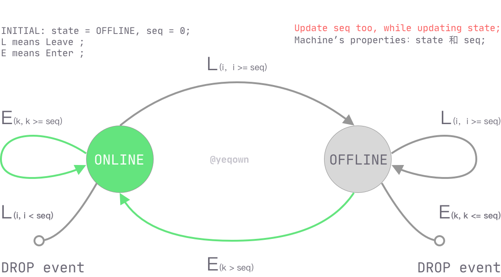

## Online or offline state machine

To judge online or offline state of client by sequences of event, here provide a state machine to indicate 
how the state transition `between` online and `offline`. 

Event includes: `enter` and `leave`. 

State includes `online` and `offline`.

For example (sequences):

* `E1 L1 E2 L2` as OFFLINE
* `E1 L2 L1 E1` as OFFLINE
* `E1 L1 L2 E2` as OFFLINE
* `E1 E2 E3 L1 L2` as ONLINE
* `E1 E2 L2 E3 L1` as ONLINE
* `E1 E2 L2 E3 L3 L1` as OFFLINE
* `E1 E2 L2 E3 L1 L3` as OFFLINE

