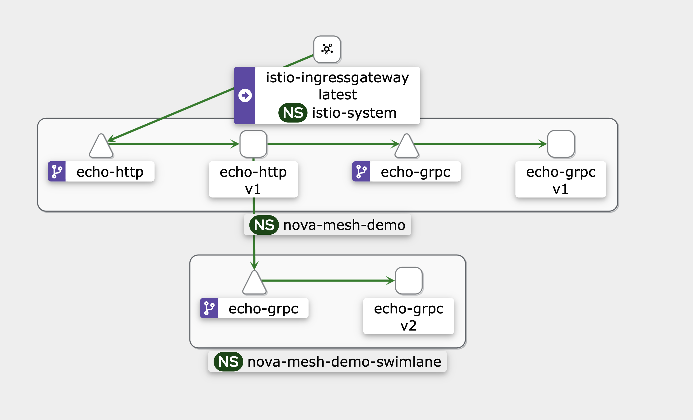

## istio-swimlane mocking

创建 ns 并开启 istio 注入

```bash
kubectl create ns nova-mesh-demo
kubectl label ns nova-mesh-demo istio-injection=enabled
kubectl create ns nova-mesh-demo-swimlane
kubectl label ns nova-mesh-demo-swimlane istio-injection=enabled
```

部署服务 v2

```bash
kubectl apply -f kube/echo-http.yaml -n nova-mesh-demo
kubectl apply -f kube/echo-grpc.yaml -n nova-mesh-demo
kubectl apply -f kube/echo-grpc-v2.yaml -n nova-mesh-demo-swimlane
```

部署 istio 规则

```bash
kubectl apply -f networking/gateway.yaml -n nova-mesh-demo
kubectl apply -f networking/virtual-service-all.yaml -n nova-mesh-demo
```

请求

```bash
minikube tunnel

# ingressgateway 的 ip 和端口
kubectl get svc istio-ingressgateway -n istio-system -o json

# http
# 10.100.247.116:8080
curl -v -H "x-mesh-swimlane: v2" http://IP:PORT/echo/v1
curl -v -H "x-mesh-swimlane: v2" http://IP:PORT/echo/v2
curl -v -H "x-mesh-swimlane: v1" http://IP:PORT/echo/v3
curl -v -H "x-mesh-swimlane: v2" http://IP:PORT/echo/v3
```

